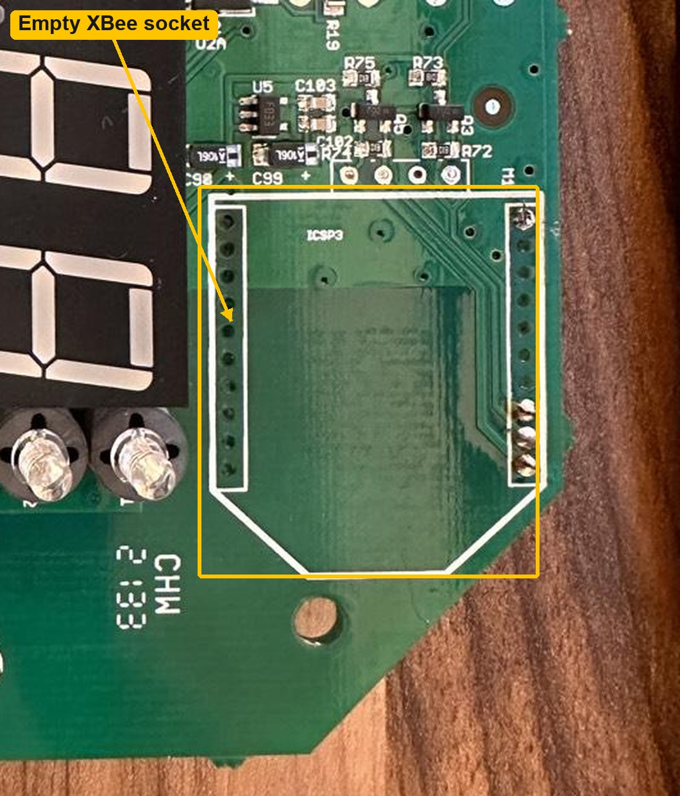
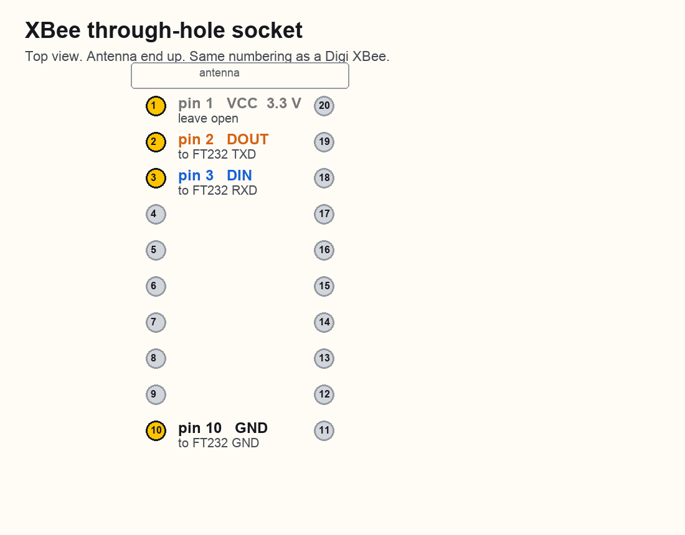
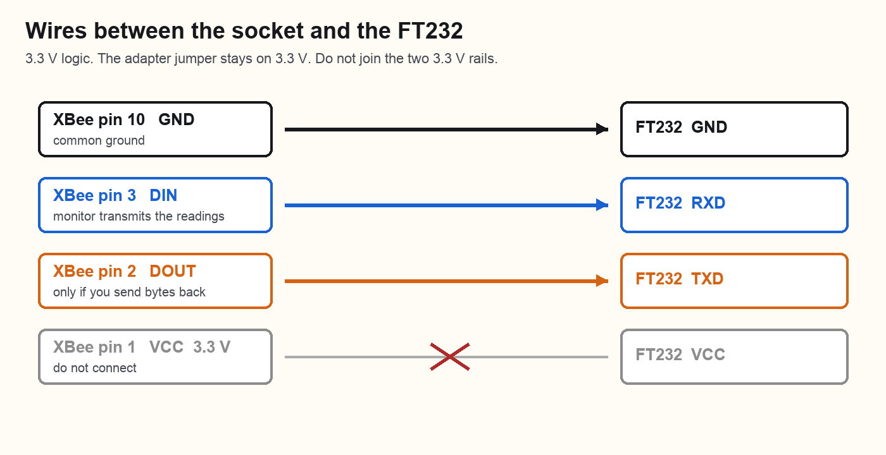
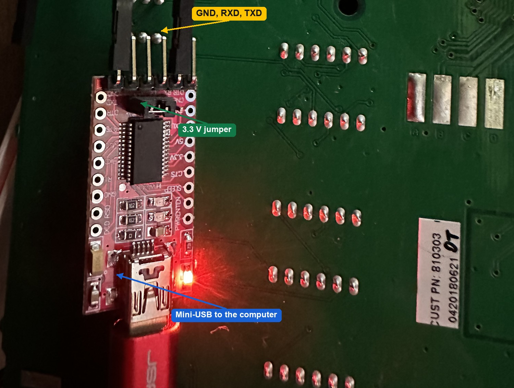
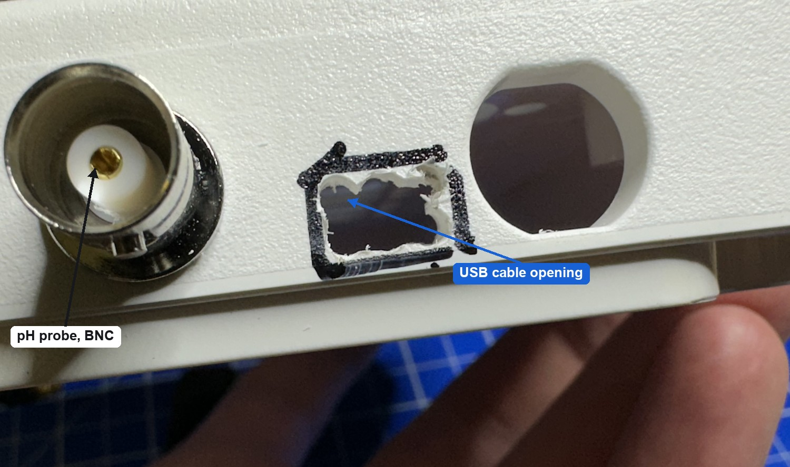
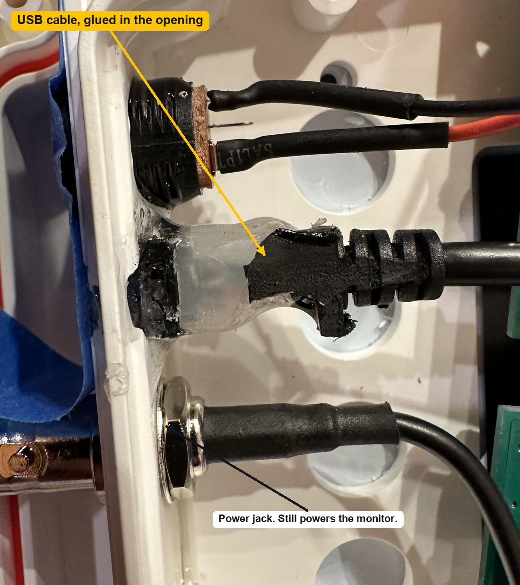

# Bluelab Guardian Monitor serial tap

Read pH, conductivity and temperature from a Bluelab Guardian Monitor over USB.

The display board has an empty socket for a Digi XBee radio. Guardian Connect uses that socket. This monitor has no radio fitted, but the microcontroller still prints a plain-text line on the radio UART. An FT232RL adapter brings that line out through a USB cable.

Logic level is **3.3 V**. The monitor needs its own DC supply. USB only powers the adapter.

## Where the wires go

The socket is on the display board, next to the seven-segment displays. It is not populated.



Pin numbering is the standard XBee through-hole layout. Only four pins matter. Pin 1 is 3.3 V and stays open. Pin 3 is the pin the monitor transmits on.



| XBee pin | Name | FT232 pin | Why |
| --- | --- | --- | --- |
| 1 | VCC, 3.3 V | do not connect | The adapter is powered from USB. Do not tie the two 3.3 V rails together. |
| 2 | DOUT | TXD | The monitor listens here. Needed only if a program sends bytes back. |
| 3 | DIN | RXD | The monitor transmits the readings here. |
| 10 | GND | GND | Common ground. |



Set the small jumper on the red FT232 board to **3.3 V**, not 5 V. A 5 V UART level can damage the monitor.

The built unit uses three wires: ground, RXD and TXD. They are soldered to the XBee pads and plugged onto the adapter header.



The USB cable leaves through an opening cut in the bottom edge, between the pH BNC connector and the round hole beside it. The barrel jack is still the power input for the monitor.





## Check the pins with a multimeter

The photos do not show which Dupont plug sits on which FT232 pin. The housings cover the silkscreen. Do not trust wire color. Confirm the four pads on your own board before you copy this wiring.

Unplug the USB cable and the monitor power supply for every continuity test. Use the beep / continuity range.

1. Find ground. Put one probe on the sleeve of the barrel jack, or on the FT232 pin that is printed `GND`. Touch the other probe to each XBee pad and each jumper wire. The pad and the wire that beep are ground. That wire must land on the FT232 pin printed `GND`.
2. Find 3.3 V. Plug in only the monitor power supply. Measure DC volts from the ground pad to the other pads in that same column. Pin 1, at the antenna end of the column, reads about 3.3 V. Pin 10, at the other end of that column, reads 0 V. Unplug the supply again before the next continuity test.
3. Find the two UART wires. With both supplies unplugged, beep from XBee pin 2 (`DOUT`) and pin 3 (`DIN`) to the FT232 header. Read the silkscreen next to the pin that beeps. Pin 3 must go to `RXD`. Pin 2, if it is connected, must go to `TXD`.
4. Confirm 3.3 V is not tied to the adapter. There must be no beep between XBee pin 1 and the FT232 pin printed `VCC`.
5. Confirm the adapter jumper. The small shunt must sit on the pads marked `3V3`, not `5V`. With only the USB cable plugged in, the FT232 `VCC` pin measures about 3.3 V against its `GND` pin. About 5 V means the jumper is on the wrong side. Unplug USB before you move the jumper.

The red FT232 boards are not all labeled in the same order. Read the words printed on the board you have.

## What a line means

The monitor sends one line about every 20 seconds, at 9600 baud, 8 data bits, no parity, 1 stop bit. Each line ends with a carriage return. Fields are separated by tabs.

`read_guardian.py` prints every value when a new sample arrives, labeled with the expression to copy:

```text
reading.ph                     6.20
reading.fahrenheit             69.62 F
reading.conductivity("CF")     0.00
```

The same sample in one line is:

```text
07:31:41  pH 6.20   EC 0.00   20.90 C   39.0 mV   OK  ECx Tx pHx
```

**pH 6.20** is the acidity. 7 is neutral. Lower is acidic, higher is alkaline. 6.20 is slightly acidic.

**EC 0.00** is electrical conductivity, the nutrient strength, on Bluelab's 0.0 to 5.0 EC scale. 0.00 means the probe is measuring almost no conductivity. That is what a dry probe, or a probe in very clean water, looks like.

**20.90 C** is the temperature at the temperature probe.

**39.0 mV** is not another nutrient reading. It is the raw voltage from the pH probe, the signal the monitor turns into the pH number. Near 0 mV is about pH 7. Positive voltage is below 7, negative voltage is above 7. At room temperature one pH step is about 58 mV. 39 mV is a bit below 7, and after calibration the monitor reports pH 6.20.

**OK** means the monitor is reporting the reading as good. An older capture showed `Fac` in this position while the unit was still on factory calibration.

**ECx, Tx and pHx** are not extra measurements. They are the state of the three channels:

- `EC` is conductivity
- `T` is temperature
- `pH` is the pH channel

The last letter is the state. `x` is the normal state sent together with `OK`. An older capture also showed `a`, written as `ECa` and `pHa`. That is the other state, most likely an alarm or a reading the firmware does not trust.

## Software

Python 3.9 or newer.

```bash
python3 -m venv .venv
source .venv/bin/activate
pip install -e .
./read_guardian.py
```

On macOS the port is usually `/dev/cu.usbserial-...`. Pass it if more than one USB serial device is plugged in:

```bash
./read_guardian.py /dev/cu.usbserial-A50285BI
```

Stop with Ctrl+C.

Use the library from another script. Run that script with the same virtualenv.

```python
from bluelab import Guardian

with Guardian() as monitor:
    for reading in monitor:
        print(reading.ph, reading.ec, reading.celsius, reading.ph_mv)
```

One line carries every channel. Read the fields off that object instead of asking the monitor again:

| Field | Meaning |
| --- | --- |
| `reading.ph` | pH |
| `reading.ph_mv` | pH probe voltage, millivolts |
| `reading.celsius` or `reading.temperature("C")` | temperature, °C |
| `reading.fahrenheit` or `reading.temperature("F")` | temperature, °F |
| `reading.ec` or `reading.conductivity("EC")` | conductivity, EC |
| `reading.cf` or `reading.conductivity("CF")` | conductivity factor, 1 EC = 10 CF |
| `reading.ppm_500` or `reading.conductivity("ppm500")` | TDS, 500 scale |
| `reading.ppm_700` or `reading.conductivity("ppm700")` | TDS, 700 scale |

`reading` also has `status`, `ec_flag`, `temp_flag` and `ph_flag`. Pass a device path when autodetection is not enough:

```python
Guardian("/dev/cu.usbserial-A50285BI")
```

This README and `read_guardian.py` were generated by an AI. Check the wiring on your own board with a multimeter before you rely on it.
